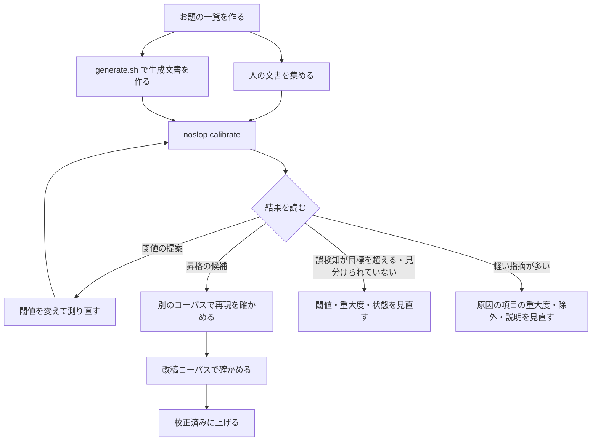
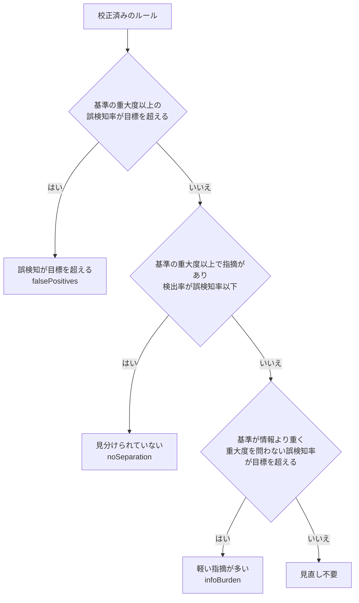

# 閾値の校正と、実験的なルールの昇格

noslop のルールと語句は、校正済み (`stable`) と実験的 (`experimental`) に分かれています。校正済みは、人の書いた文書でどれだけ誤って指摘するか (誤検知率) をコーパスで確かめたもので、既定で動きます。この文書は、その確かめ方の手順です。コーパスを作り、`noslop calibrate` で誤検知率と検出率を測り、閾値を決め、実験的なものを校正済みに上げるまでを扱います。

測った率は、そのコーパスでの値にすぎません。`noslop calibrate` は候補を挙げるだけで、閾値も状態も書き換えません。変えるかどうかは、結果と実際の指摘箇所を見て人が決めます。

## 流れ



## 1. お題をそろえたコーパスを作る

### そろえる理由

人の文書と生成文書でお題・ジャンル・長さが違うと、ルールが拾う差の多くは話題や文書の種類の違いになります。技術ブログを人の群に、エッセイを生成の群に置けば、見出しや箇条書きのルールは「AI らしさ」と無関係に差を出します。同じお題・同じジャンル・同じくらいの長さで両方をそろえ、差が文章の書きぶりから来るようにします。

### 人の文書を集める

- 自分や所属先が書いた文書か、再利用の条件がはっきりした公開文書を使います。生成 AI の手が入っていないとわかるもの (普及前に書かれたものなど) に限ります。
- ジャンル (`general` / `tech` / `business` / `essay`) ごとに分けます。1 群 10 件未満では `noslop calibrate` が警告を出します。
- 件数は、目標の誤検知率を「言い切れる」だけそろえます。目標 5% なら、人の文書が 52 件以上ないと、1 件も指摘されなくても誤検知率の 95% 上限が目標を超えます (「4. 結果を読む」の「95% 上限と件数の目安」)。1 ジャンルあたり 50〜100 件を目安にしてください。
- 形式は Markdown かテキストです。UTF-8 で保存します。
- 段落の区切りを残します。Markdown では空行が段落の区切りで、空行のない行は 1 つの段落にまとまります。1 行 1 段落で書かれた文書 (電子テキストから起こした文書に多い) は、段落のあいだに空行を入れるか、拡張子を `.txt` にします (テキストは、空行のほとんどない文書を 1 行 1 段落として読みます)。区切りが消えたまま測ると、段落を単位に見るルール (R07・R09 など) が測れません。そう見える文書があれば、`noslop calibrate` が「注意」に件数を出します。

### お題の一覧を作る

人の文書 1 件ごとに、お題を 1 行で書きます。書式は [tools/corpus/topics.example.txt](../tools/corpus/topics.example.txt) のとおり `slug: お題` です。slug は人の文書のファイル名 (拡張子を除く) と同じにします。`noslop calibrate` は、入力に指定したディレクトリからの相対パスで校正用と検証用を分けるので、ファイル名をそろえると、同じお題の人の文書と生成文書が必ず同じ側に入ります。

### 生成文書を作る

[tools/corpus/generate.sh](../tools/corpus/generate.sh) が、お題 1 件につき 1 ファイルを `claude -p` か `codex exec` で生成します。

```bash
GENRE=tech LENGTH=2500 tools/corpus/generate.sh claude:sonnet corpus/tech/ai-claude corpus/tech/topics.txt
GENRE=tech LENGTH=2500 tools/corpus/generate.sh codex corpus/tech/ai-codex corpus/tech/topics.txt
```

- お題 1 件ごとに LLM を呼ぶため、件数によっては数十分から数時間かかります。手元の端末で実行してください。途中で止めても、同じコマンドをもう一度実行すれば、まだないファイルだけを作ります。
- `LENGTH` は人の文書の字数の中央値に合わせます。
- モデルを 2 種類以上使うと、閾値が特定のモデルの癖に寄りすぎません。モデルごとに出力先を分けます。
- 利用者の設定 (CLAUDE.md・スキル・AGENTS.md など) が文体を変えると、素の生成文書にならなくなります。スクリプトは claude を `--safe-mode` で、codex を利用者の設定を読まずに動かします。codex の全体向けの指示ファイルを置いているなら、生成の間は外してください。

置き場所の例です (ジャンルごとにディレクトリを分けます)。

```text
corpus/tech/topics.txt
corpus/tech/human/<slug>.md
corpus/tech/ai-claude/<slug>.md
corpus/tech/ai-codex/<slug>.md
```

## 2. コーパスをコミットしない

人の文書は著作権や個人情報を含むことがあり、生成文書にも利用規約や再配布の問題があります。どちらもリポジトリに入れません。リポジトリの中に置くなら、`.gitignore` でディレクトリごと除外します。

```gitignore
# 校正用のコーパス (人の文書・生成文書) はコミットしない
/corpus/
# generate.sh の書きかけのファイル
.*.md.part
```

`/corpus/` のようにディレクトリを指す書き方にしてください。`/corpus/**` のようにファイルに当たる書き方をすると、`noslop calibrate` もその中のファイルを読まなくなります (ファイルを 1 件も集められなかったディレクトリは、結果の「読めなかった入力」に出ます)。お題の一覧もお題から文書が特定できるなら、同じように除外します。

## 3. noslop calibrate を実行する

```bash
noslop calibrate --human <DIR> --ai <DIR> [--genre <GENRE>] [--target-fp 0.05] [--holdout 0.3] [--format text|json|markdown]
```

| オプション | 既定 | 意味 |
|---|---|---|
| `--human` | (必須) | 人の文書のファイルかディレクトリ。繰り返して複数指定できる |
| `--ai` | (必須) | 生成文書のファイルかディレクトリ。モデルごとのディレクトリを `--ai` を繰り返して並べられる |
| `--genre` | `general` | ジャンル。ジャンルごとに閾値が違うルールがあるので、コーパスのジャンルに合わせる |
| `--target-fp` | `0.05` | 許容する誤検知率 |
| `--holdout` | `0.3` | 検証用に取り分ける文書の割合 |
| `--min-detection` | `0.2` | 校正済みに上げる候補とする検出率の下限 |
| `--no-experimental` | — | 実験的なルールと語句を測らない (既定の動作だけを測るので速い) |
| `--format` | `text` | 出力形式。記録を残すなら `markdown`、ほかの道具で読むなら `json` |
| `--config` / `--no-config` | — | 設定ファイルの指定・読まない (`noslop check` と同じ) |

読めなかった入力があると、結果を出したうえで終了コード 2 で終わります (読めなかった入力は標準エラーにも出します)。

例:

```bash
noslop calibrate --human corpus/tech/human --ai corpus/tech/ai-claude --ai corpus/tech/ai-codex \
  --genre tech --format markdown > calibration-tech.md
```

設定ファイルは `noslop check` と同じように読みます。`[rules.<ID>]` で閾値を変えていれば、その値が「現在の閾値」になります。`[rules.<ID>] severity` で重大度を上書きしていれば、指摘はその重大度で数えます (校正の基準は変わりません)。実験的なルールと語句も既定で測ります。

### 測り方

- 誤検知率は、人の文書のうち、そのルールに 1 件以上指摘された文書の割合です。検出率は、同じことを生成文書で数えた割合です。どちらも、まず重大度 (情報・警告・重大) を問わずに数えます。
- あわせて重大度の内訳を出します。重大度ごとの件数と、その重大度の指摘が出た文書の数です。1 つの文書に警告と重大の両方が出れば、その文書は両方に数えます。
- 下限の重大度ごとの率も出します。「警告以上」は警告か重大の指摘が出た文書、「重大」は重大の指摘が出た文書の割合で、どちらも文書の重複を除いて数えます。
- 率には片側 95% の上限を添えます (Wilson のスコア区間)。件数が少ないと、指摘が 0 件でも本当の率が目標を超えている可能性を消せないためです。
- 1000 字あたりの件数は JSON に出ます。
- 既定で動くルールは既定の動作で、既定では動かないルールは `--experimental` を付けたときの動作で測ります。校正済みのルールにある実験的な語句は、実験的な動作で別に数えます。
- 抑制コメントで残した指摘も数えます。検出器そのものの反応を測るためです。
- 文書を校正用と検証用に分けるときは、入力に指定したディレクトリからの相対パスのハッシュを使います。何度実行しても同じ分け方になり、置き場所を変えても変わりません。
- 語句の項目は、辞書の項目ごとに数えます。リテラルの項目はその文字列、正規表現の項目は `/パターン/` の名前で 1 行にまとまり、よく出た表記を 3 つまで添えます。辞書の項目を持たず構文の型で拾うルールは、比べたい単位を項目にしています。P13 は述語の終止形 (「示し」「示さ」はどちらも「示す」)、P14 はダッシュの使い方 (対で挟んだ挿入句か、日本語のあいだの二倍ダッシュか)、P20 は述語の語形 (「です＋コロン」など) です。項目を決めていないルール (P15〜P17 などの読みやすさのルール) は、一致した表記ごとに数えます。項目の件数にも、ルールと同じ形で重大度の内訳が付きます。

## 4. 結果を読む

### ルール別の反応

ルールごとに、状態・校正の基準・誤検知率と検出率が並びます。率は 2 通りです。

| 列 | 意味 |
|---|---|
| 基準 | 校正の基準の重大度 (次の節) |
| 誤検知 全 / 検出 全 | 重大度を問わずに数えた率。昇格と「軽い指摘が多い」の判定に使う |
| 誤検知 基準 / 検出 基準 | 基準の重大度以上の指摘だけで数えた率。見直し (誤検知が目標を超える・見分けられていない) の判定に使う |

text と markdown の表は割合だけを出します。件数・95% 上限・重大度ごとの内訳・1000 字あたりの件数は JSON の `rules[].human` / `rules[].ai` にあります。読みやすさのレーン (R03 など) は AI らしさの判定ではないので、昇格と見直しの対象から外しています。率は参考として読んでください。

### 校正の基準

警告で校正したルールにも、確度の低い語句を意図して情報にしたものがあります (P02 の `さて、` のように、人の文章にも一定数出る弱い手掛かり)。R05 のように、比率で情報・警告・重大を変えるルールもあります。重大度を問わずに数えると、こうしたルールが情報の指摘だけで「誤検知が目標を超える」に並んでしまいます。

そこでルールごとに、誤検知率の目標を当てはめる重大度を決めています。これが校正の基準です。

| ルール | 校正の基準 |
|---|---|
| 既定の重大度が警告以上のルール (P01・P02・R01 など) | 警告 (警告以上の指摘で数える) |
| 既定の重大度が情報のルール (P03・P12・P13・R06 など) | 情報 (重大度を問わない) |
| R05 | 重大。元の校正は「人の文書で重大になる割合 4.9%」で区切りを決めたため |

既定の重大度が情報のルールは、情報がそのルールの本来の重さなので、基準も情報です。P12 の `することによって` のような情報の語句も、そのまま誤検知として数えます。

基準はルールの `Rule::calibration_basis` で決まります。校正済みのルールの基準は、`noslop explain <ID>` の「校正の基準」と、`noslop rules --format json` の `calibrationBasis` でも確かめられます。情報も利用者の画面に出るので、無視してよいわけではありません。基準で目標以下でも、重大度を問わないと目標を超えるルールは「軽い指摘が多い」として挙げます (「6. 見直しの 3 つの理由」)。

### 95% 上限と件数の目安

誤検知率が 0% でも、文書が少なければ「本当は目標を超えている」可能性が残ります。`noslop calibrate` は誤検知率に片側 95% の上限 (Wilson のスコア区間、z = 1.6449) を添え、昇格の候補の上限が目標を超えるときは注記を付けます。

人の文書で 1 件も指摘されなかったときの上限と、目標以下と言い切るのに要る文書の数は次のとおりです。人の文書がこの数に届かないと、結果の「注意」に必要な件数が出ます。

| 人の文書 | 0 件指摘のときの 95% 上限 |
|---|---|
| 10 件 | 21.3% |
| 20 件 | 11.9% |
| 30 件 | 8.3% |
| 50 件 | 5.1% |
| 100 件 | 2.6% |

| 目標の誤検知率 | 0 件指摘で言い切るのに要る人の文書 |
|---|---|
| 10% | 25 件 |
| 5% | 52 件 |
| 3% | 88 件 |
| 2% | 133 件 |
| 1% | 268 件 |

1 件でも指摘されれば、要る件数はさらに増えます (人の文書 100 件で 1 件なら上限 4.4%、2 件なら 5.9%)。

### 閾値

閾値を持つルールは、設定キーごとに次の 2 行が出ます。

- 現在: 今の閾値での率 (全文書と検証用の文書)
- 提案: 校正用の文書で、誤検知率が目標以下のまま検出率が最大になる閾値と、その値での率 (校正用と検証用の文書)

提案の選び方は次のとおりです。候補は、今の閾値、校正用の文書で観測した値の隣り合う 2 つのあいだの値、値を測れた文書をすべて指摘する値です。誤検知率が目標以下で生成文書を 1 件以上拾う候補のうち、検出した文書が最も多いものを選びます。同じ数なら誤検知が少ないほう、それも同じなら今の値に近いほうを選びます。整数の設定キー (文数・字数・回数) は、指摘する側に丸めます。今の値が最もよければ「現在の値のまま」と出ます。

検証用の文書の率は、選ぶのに使っていない文書での値です。校正用では目標を満たしたのに検証用で大きく超えるなら、その閾値はコーパスに合わせすぎています。採らないか、文書を増やして測り直します。

いくつか注意があります。

- 値を測れなかった文書 (文数が足りないなど、判定の前提を満たさない文書と、数える対象が 1 つもなく閾値をどう変えても指摘しない文書) は、そのキーでは指摘されない文書として分母に残します。「値を測れた文書」の数で、閾値がどれだけの文書に効くかを確かめてください。
- 閾値を 2 つ以上持つルール (R01 の `threshold` と `info_threshold`、R04、R12、S09) では、キーごとの率はそのキーの判定だけの率です。ルール全体の率は「ルール別の反応」で見ます。
- 指摘するかどうかではなく、重大度の切り替えを決める閾値があります (R05 の `error_above`)。向きが「閾値以上で重大」と出て、このキーの率は重大の指摘が出た文書の割合です。R05 の校正の基準は重大なので、この率が見直しに使う率と一致します。JSON では `thresholds[].switchesTo` が `error` になります。

### 校正済みに上げる候補・見直しが必要な校正済みルール

次の 2 節の条件で挙げます。候補に挙がっても自動では何も変わりません。

## 5. 校正済みに上げる条件

`noslop calibrate` が候補に挙げる条件です。目標の誤検知率は `--target-fp` (既定 5%)、検出率の下限は `--min-detection` (既定 20%) です。下の表の 20% は、この下限を既定のまま使ったときの値です。率はどれも重大度を問わずに数えます。情報だけのルールは、警告以上で数えると人の文書でも生成文書でも 0% に見えるためです。

| 対象 | 条件 |
|---|---|
| 実験的なルール | 今の閾値で、全文書の誤検知率が目標以下、検出率が 20% 以上 |
| 実験的なルール (指摘するかどうかを決める閾値が 1 つ) | 上を満たさなくても、提案の閾値で、検証用の文書の誤検知率が目標以下、検出率が 20% 以上なら「閾値を変えれば候補」 |
| 校正済みのルールにある実験的な語句 | 項目ごとに見て、生成文書 3 件以上に出て、生成文書での割合が人の文書の 2 倍以上あり、上げた後のルール全体の誤検知率が目標以下 |

対象は組み込みの AI 臭さのレーンのルールだけです。独自ルールと読みやすさのレーンは挙げません。

誤検知率の 95% 上限が目標を超える候補には「件数が少なく、目標以下と言い切れません (95% 上限 N%)」と注記が付きます (JSON では `smallSample: true`)。候補からは外しませんが、上げる前に人の文書を増やして測り直してください。

候補を実際に上げる前に、次を確かめます。

1. 別のコーパスでも候補になるか。別のジャンル、または別のモデルの生成文書で測り直します。1 つのコーパスでしか条件を満たさないものは上げません。
2. 人の文書での指摘を目で見る。人の文書で出た指摘が、書き手が直したほうがよいものなら、誤検知率が高めでも害は小さく、逆に文体の正当な選択を咎めているなら、率が低くても重大度を下げます。
3. 直し方の手掛かりが推敲に役立つか。「7. 改稿コーパスで確かめる」で確かめます。

## 6. 見直しの 3 つの理由

見直しが必要な校正済みルールは、次の 3 つの理由に分けて出します。どの理由にも、使った校正の基準、人の文書での重大度ごとの内訳、人の文書で多く出た項目 (語句ルールだけ。項目の重大度つきで 3 つまで) を添えます。



| 理由 | 判定 | 添える項目 | 何をするか |
|---|---|---|---|
| 誤検知が目標を超える | 基準の重大度以上で数えても誤検知率が目標を超える。校正が成り立っていない | 基準以上の重大度の項目 | 閾値を変える、重大度を下げる、実験的に戻す、のどれが妥当かを決める |
| 見分けられていない | 基準の重大度以上で、生成文書で指摘される割合が人の文書を上回らない | 基準以上の重大度の項目 | 検出器が差を拾えていない。同じく、閾値・重大度・状態を見直す |
| 軽い指摘が多い | 基準では目標以下だが、重大度を問わないと目標を超える (基準が情報より重いルールだけ) | 基準より軽い重大度の項目 | 直ちに実験的に戻す話ではない。原因の項目の重大度・除外・説明を見直す材料にする |

「軽い指摘が多い」は、校正そのものは成り立っているが、利用者の画面に情報などの軽い指摘が多く並ぶ、という意味です。添えた項目を人の文書で目で見て、次のどれが合うかを決めます。

- 人の文章に普通に出る語なら、辞書から外すか、実験的な項目に戻す
- 特定の文脈 (引用・定型の挨拶など) で出るなら、除外の条件を足す
- 手掛かりとしては残すなら、説明 (`noslop explain` の「根拠」) に人の文章にも出ることを書き、弱い手掛かりの注記を付ける (リテラルは `Entry::weak`、正規表現の項目と実験的な項目は `.with_note(WEAK_SIGNAL_NOTE)`)

R05 のように比率で重大度を変えるルールでは、内訳の情報・警告の文書の数が手掛かりです。警告の区切り (`info_below`) を動かすかどうかを考えます。

## 7. 改稿コーパスで確かめる

指摘が「直す価値のある箇所」を指しているかは、検出率ではわかりません。指摘に従って直した文章が、指摘なしで直した文章より良くなるかを、ブラインド評価で確かめます。

1. 生成文書から 20 件以上を選びます。`noslop calibrate` で検証用に回った文書を使うと、閾値を選んだ文書と重なりません。
2. 各文書を 2 通りに直します。直すのは同じモデルか同じ人で、指示の文面も同じにします。
   - A (ブリーフなし): 「次の文章を、内容を変えずに、読みやすく自然な日本語に推敲してください」とだけ頼む
   - B (ブリーフあり): 同じ指示に、`noslop check --format brief <FILE>` の出力を添えて頼む
3. 評価用に並べ替えます。組ごとに A と B のどちらを先に置くかを乱数で決め、ファイル名を意味のない ID に替えます。対応表は評価が終わるまで開きません。
4. 評価者 (人。できれば 2 人以上) が、元の文章と 2 つの改稿を読み、より自然なほうと、元の意味をよく保っているほうを選びます。引き分けも認めます。評価者には noslop の指摘を見せません。
5. 対応表を開き、引き分けを除いて B が選ばれた割合を数えます。半分を明らかに上回れば、指摘は推敲に役立っています。下回るなら、B で直された箇所を見て、改稿を悪くしたルールを探します。

改稿後の文章の良し悪しを noslop 自身で測ってはいけません。ブリーフに従って直せば指摘は減るので、指摘の減少は良くなった証拠になりません。

## 8. 変更を反映する

上げると決めたら、コードと説明を合わせて変えます。

- ルールを上げる: そのルールの `RuleMeta` の `status` を `RuleStatus::Stable` にします。
- 語句を上げる: `Entry::exp_lit` / `Entry::exp_re` を `Entry::lit` / `Entry::re` にします。人の文書にも一定数出るなら、重大度を情報にするか `Entry::weak` にします。`Entry::weak` はリテラル専用なので、正規表現の項目は `Entry::re(…, Info).with_note(WEAK_SIGNAL_NOTE)` にします。実験的なうちに `with_note` で付けた注記は、上げたあとも残します。
- 閾値を変える: ルールの `new` にある既定値を変えます。ジャンルごとに変えるなら、そのジャンルの分岐だけを変えます。
- 特定の重大度になる割合で校正したルールは、`Rule::calibration_basis` でその重大度を返します (R05 が重大を返すのと同じ)。
- `noslop explain` の「根拠」の節に、コーパスの規模 (人・生成の件数、ジャンル、モデルの数)、誤検知率 (どの重大度で数えたか)、検出率を書きます。件数が少ないなら、95% 上限も書きます。
- `noslop rules --format markdown --no-config > docs/rules.md` で docs/rules.md を作り直します。

見直しでは、閾値を変える、重大度を下げる、実験的に戻す、除外を足す、説明を足す、のどれが妥当かを、人の文書での指摘を見て決めます。どれを選んでも、「根拠」の節に理由と数値を残してください。

## JSON で読むとき

`--format json` の主なフィールドです (名前は camelCase、`schemaVersion` は 1)。

| フィールド | 中身 |
|---|---|
| `rules[].calibrationBasis` | 校正の基準 (`info` / `warning` / `error`) |
| `rules[].human` / `rules[].ai` | `docs`・`fired`・`hits`・`rate`・`upper95`・`per1000Chars` (重大度を問わない)、`bySeverity` (`info` / `warning` / `error` ごとの `fired`・`hits`)、`atLeast` (`warning` / `error` ごとの `fired`・`rate`・`upper95`) |
| `thresholds[].switchesTo` | 重大度の切り替えを決める閾値なら、その重大度。指摘するかどうかを決める閾値なら `null` |
| `thresholds[].current` / `suggested` | 閾値での率 (`calibration`・`holdout`・`all`)。率の形は下の Outcome |
| `items[]` | 語句の項目ごとの `item`・`examples`・`severity`・`status`・`human`・`ai` (形は `rules[].human` と同じ)・`promotedRule` |
| `promotions[]` | `item`・`threshold`・`outcome`・`basis` (`all` / `holdout`)・`smallSample` |
| `reviews[]` | `reason` (`falsePositives` / `noSeparation` / `infoBurden`)・`calibrationBasis`・`outcome` (基準の重大度以上で数えた率)・`anySeverity` (重大度を問わない率)・`humanItems` |

Outcome (率の組) は `atLeast` (数えた重大度の下限。`info` なら重大度を問わない)・`humanFired`・`humanDocs`・`aiFired`・`aiDocs`・`falsePositive`・`falsePositiveUpper95`・`detection` を持ちます。
