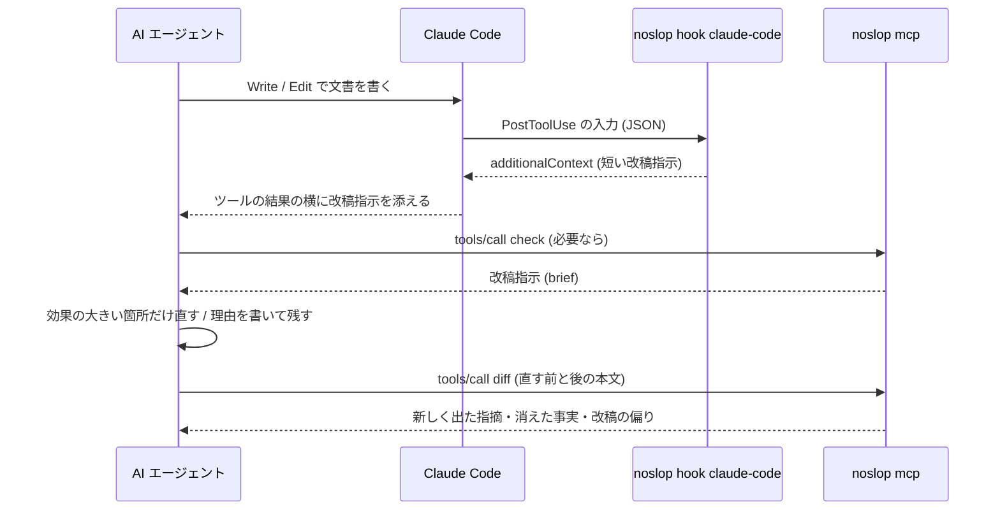

# AI エージェントとの連携

noslop の指摘を、文章を書いた AI エージェント (または人間の編集者) に渡す方法は 7 つあります。

| 方法 | 使いどころ | 渡すもの |
|---|---|---|
| `noslop check --report brief` | 検査結果を AI や編集者に貼り付けて直してもらう。プログラムや LLM に渡すなら JSON・TOON | 改稿指示 (Markdown・JSON・TOON) |
| `noslop skill-install` | エージェントに、日本語の文章を書いた・直した後の見直しの手順を覚えさせる | スキル (`SKILL.md`) |
| `noslop mcp` | エージェントが自分で検査・改稿の前後の比較を呼ぶ (Claude Code・Codex CLI など) | 改稿指示・確認事項 (Markdown・JSON・TOON) |
| `noslop hook claude-code` | Claude Code がファイルを書いた直後、gws で Google ドキュメント・スプレッドシートに書き込む前、応答を終えたときに、自動で指摘を渡す | 短い改稿指示 |
| `noslop hook command` | claw-hooks のコマンドフックから、gws で書き込む値を書き込む前に検査する (Claude Code・Codex CLI など) | 止める理由・短い改稿指示 (テキスト) |
| `noslop hook file <PATH>` | 編集したファイルのパスだけを渡すフックの仕組み (claw-hooks の extension_hooks など) から、同じ指摘を渡す | 短い改稿指示 (テキスト) |
| `noslop hook git-diff` | フックの入力を渡せない Stop の仕組み (claw-hooks の stop_hooks など) から、リポジトリのコミットしていない変更の指摘を渡す | 短い改稿指示 (テキスト) |

どの方法でも、渡すのは「どこを、なぜ見直すか」と改稿の制約です。語句の置き換え方は指示しません。指摘は疑いの提示なので、件数を減らすこと自体を目的にすると、読点を一律に削る・体言止めを機械的に足すといった別の均一さが生まれます。そのため改稿指示には、残してよいことと、再実行を 1 回で打ち切ることを必ず書いています。



## 改稿指示 (`--format brief`)

```bash
noslop check --format brief docs/
noslop check --format brief --brief-limit 3 draft.md | pbcopy   # AI に貼り付ける
cat draft.md | noslop check --format brief --stdin-filename draft.md -
```

出力は Markdown で、次の順に並びます。

1. **改稿のルール**: 主張・確信度・数字・固有名詞・引用・想定読者を変えない、原文にない事実・数字・体験を足さない (足りなければ書き手に確認する)、同じ直しを全箇所に一律に当てない、指摘は疑いなので残してよい (理由は書き手への報告に添える)、件数を減らすことを目的にしない、再実行は 1 回だけ (直す前の文書があれば `noslop diff` で、新しく出た指摘と消えた数字・固有名詞をまとめて確かめる)
2. **ファイルごとの節**: 未抑制の指摘の件数 (AI 臭さの校正済み / 実験的 / 独自ルール / 読みやすさ)
3. **優先して見る箇所**: ルールごとにまとめ、重大度の高い順・件数の多い順に並べる。ルールの日本語名と件数 (「AI 臭さ・警告 2 件」のように、レーン名・最も高い重大度・件数。実験的な項目の指摘だけなら「・実験的」が付く)、なぜ疑わしいか (説明文の「なぜ問題か」の冒頭)、直し方の方向、該当箇所 (行・指摘・原文) を載せる。1 ルールあたり `--brief-limit` 件 (既定 5) まで並べ、残りは「ほか N 件」とまとめる
4. **読みやすさの指摘**: AI 臭さとは別の、優先度の低い指摘。件数の書き方は優先して見る箇所と同じ (「読みやすさ・情報 1 件」)
5. **編集の問い**: ルールでは拾えない観点の問い (具体性、段落の論旨、エッセイなら書き手自身の判断や経験)。答えが「いいえ」でも、書き手に確かめずに内容を足さないよう書き添える

抑制コメントで残した指摘は載せません。指摘が 1 件もなければ、noslop の観点では直す必要がないことと、内容の正しさや読み手への合い方までは確かめていないことだけを出します。終了コードは他の形式と同じです (`--fail-on`)。

文書全体の点数は付けません。件数は見直す箇所の量で、文章の出来を表すものではないため、改稿のルールで件数を減らすことを目的にしないよう断っています。抑制コメントも、指摘を消すための手段としては勧めません。改稿した側は、残した指摘とその理由を書き手への報告に添え、書き手が今後も残すと決めた箇所にだけ抑制コメントを書きます。

### JSON と TOON (`--report brief --format json|toon`)

```bash
noslop check --report brief --format json draft.md   # プログラムで扱う
noslop check --report brief --format toon draft.md   # LLM に少ないトークンで渡す
```

Markdown と同じ改稿指示を、データとして出します。JSON と TOON は同じデータの符号化違いです。

| 階層 | フィールド |
|---|---|
| 全体 | `schemaVersion` (版。互換性のない変更で上げる)・`kind` (`brief`)・`tool`・`columnUnit` (`unicode-scalar`)・`settings` (`genre`・`experimental`・`method` (判定の方式。`dictionary`: 形態素解析の辞書の品詞で判定した、`surface`: 辞書なしの近似)・`dictionary` (使った辞書の名前。手元のパスは載せない))・`revisionRules` (改稿のルール)・`editorialQuestions` (編集の問い)・`note` (指摘がないときの断り書き。あれば `null`)・`files`・`cleanFiles` (指摘のないファイル。20 件まで)・`omittedCleanFiles`・`warnings` (抑制コメントの注意。`path`・`message`)・`errors` (読めなかったファイル。`path`・`message`) |
| `files[]` | `path`・`counts` (`stableSlop`・`experimentalSlop`・`custom`・`readability`)・`rules`・`occurrences` |
| `rules[]` | `ruleId`・`ruleName`・`title`・`lane`・`maxSeverity`・`experimentalOnly`・`count` (未抑制の件数)・`omittedCount` (`--brief-limit` を超えて載せなかった件数)・`why` (なぜ疑わしいか)・`hint` (直し方の方向。2 つあれば ` / ` でつなぐ) |
| `occurrences[]` | `ruleId` (`rules` を参照)・`line`・`column` (1 始まり。列は Unicode スカラー値の個数)・`message`・`excerpt` (指摘を含む文の抜粋。文を持たない指摘は `null`) |

ルールと該当箇所を入れ子にせず、2 つの表に分けているのは、TOON で 1 行 1 要素の表 (tabular form) にするためです。入れ子にすると、ルールごとに項目名の行が並んで、改行なしの JSON より長くなりました。表に分けると、同梱の `examples/ai-smelly.md` の改稿指示で、トークン数 (`o200k_base`) が TOON 2,770・Markdown 2,980・JSON 3,137 (改行なし) / 3,802 (整形) になります。

データには、metrics・fingerprint・抑制した指摘・バイト位置を入れません。指摘の追跡や前回の結果との突き合わせには全指摘のレポート (`--format json`・`--format toon`) を使います。`note` は指摘がないときだけ入り、内容の正しさまでは確かめていないことを伝えます。

TOON の符号化は公式の Rust 実装 [toon-format](https://github.com/toon-format/toon-rust) (仕様 v3.0) で行います。区切りはカンマ、インデントは 2、キーの折りたたみはせず、末尾に改行を付けません。出力は、仕様 v4.1 のリファレンス実装 (`@toon-format/toon` 4.1.1) の strict モードで、JSON と同じデータに戻ることを確かめています (カンマ・コロン・引用符・バックスラッシュ・`-` や `#` で始まる文字列を含む抜粋も含めて)。

## スキル (`noslop skill-install`)

```bash
noslop skill-install claude                       # ~/.claude/skills/noslop/SKILL.md
noslop skill-install codex                        # ~/.codex/skills/noslop/SKILL.md
noslop skill-install claude --dir .claude/skills  # プロジェクトに置く
```

[skills/SKILL.md](../skills/SKILL.md) (バイナリに埋め込んである) を、エージェントのスキルの置き場に `noslop/SKILL.md` として書きます。すでにあれば上書きするので、noslop を更新したら入れ直してください。ソースから `make install` で入れた場合は、バイナリを入れたあとに Claude Code と Codex CLI の両方へ自動で入れ直します (入れる先は `SKILL_TARGETS` で選べ、空にすると入れません)。スキルには、使う場面 (日本語の文章を書いた・直した後の見直し、推敲、AI っぽさのチェック)、手順 (`noslop check --report brief --format toon` で直す箇所を受け取る → 改稿のルールに従って直す → `noslop diff` で 1 回だけ確かめる)、TOON の読み方を書いています。

## MCP サーバー (`noslop mcp`)

標準入出力で JSON-RPC 2.0 のメッセージを 1 行に 1 つずつやり取りする MCP サーバーです。非同期ランタイムは使わず、1 リクエストずつ順に処理します。

### ツール

| ツール | 引数 | 返すもの |
|---|---|---|
| `check` | `text` (必須)、`filename` (拡張子で Markdown・テキスト・コードを判断。コードならコメントだけを検査する)、`genre`、`experimental`、`report` (`brief` 既定 / `full`)、`format` (`markdown` / `json` / `toon`) | `report: brief` は改稿指示 (`format` の既定は `markdown`)、`report: full` は `check --format json` と同じ全指摘のレポート (`format` の既定は `json`)。`markdown` は `brief` のときだけ |
| `diff` | `before`・`after` (必須)、`filename`、`genre`、`experimental`、`format` (`text` 既定 / `json` / `toon`) | `noslop diff` と同じ確認事項 (新しく出た指摘・事実の変化・改稿の偏り)。text は端末向けの書式を外して返す |
| `explain` | `rule` (必須、ID か名前)、`genre` | `noslop explain` と同じ説明 |
| `rules` | `genre`、`experimental` | `noslop rules` と同じ一覧 |

引数の誤り (本文がない、未知のジャンルなど) と設定ファイルの誤りは、サーバーを止めずにツールの実行エラー (`isError: true`) として返します。エージェントはその文面を読んで引数を直せます。未知のツール名と壊れたメッセージは JSON-RPC のエラーで返します。1 メッセージは 8 MiB、`check` の本文は 4 MiB までです。

### 対応する版

| 版 | 方式 |
|---|---|
| `2026-07-28` | リクエストごとに `_meta` で版とクライアントの能力を名乗る方式。`server/discover` に答え、結果に `resultType` と、`_meta` のサーバー名を載せる。対応外の版には `-32022` (Unsupported protocol version) を、`_meta` の必須項目がなければ `-32602` を返す |
| `2025-11-25`・`2025-06-18`・`2025-03-26`・`2024-11-05` | `initialize` で版を決める方式。要求された版に対応していれば同じ版を、そうでなければ `2025-11-25` を返す。結果はその版の形のまま (`resultType` は付けない) |

`_meta` で版を名乗らないリクエストは、`initialize` の後 (と `ping`) だけ受け付けます。版の決まらないまま処理すると、クライアントがサーバーの方式を判別できないためです。

### 設定ファイル

`check` と同じく、ユーザーの設定 (`~/.config/noslop/config.toml`) に、`noslop.toml` / `.noslop.toml` を親ディレクトリへたどって見つけたプロジェクトの設定を重ねます。プロジェクトの設定を探し始める場所は、環境変数 `CLAUDE_PROJECT_DIR` があればそのディレクトリ (Claude Code が起動したサーバーに渡すプロジェクトのルート)、なければサーバーの作業ディレクトリです。`noslop mcp --config path/to/noslop.toml` でプロジェクトの設定を差し替えたり、`--no-config` でどちらも読まないようにしたりもできます。設定を変えたらサーバーを起動し直してください。

設定ファイルの `[morphology]` (形態素解析の辞書) も効きます。既定 (`dictionary = "auto"`) では、share ディレクトリに取得した配布辞書があればそれを、なければ同梱の辞書を使います。同梱の辞書は、辞書を使うルール (P15・P16) が動く最初の呼び出しで読み、以後の呼び出しで共有します。ファイルの辞書 (share ディレクトリの辞書を含む) は、呼び出しごとに mmap で読みます。使った方式は結果の `settings` (`method`・`dictionary`) に載ります。フックは既定で読みやすさのルールを止めて動くので、辞書を探しません。

### Claude Code に登録する

```bash
# このプロジェクトだけで使う (local スコープ)
claude mcp add noslop -- noslop mcp

# チームで共有する (.mcp.json に書かれる)
claude mcp add --scope project noslop -- noslop mcp
```

`.mcp.json` に直接書く場合:

```json
{
  "mcpServers": {
    "noslop": {
      "type": "stdio",
      "command": "noslop",
      "args": ["mcp"]
    }
  }
}
```

### Codex CLI に登録する

```bash
codex mcp add noslop -- noslop mcp
```

`~/.codex/config.toml` (信頼したプロジェクトなら `.codex/config.toml` も可) に直接書く場合:

```toml
[mcp_servers.noslop]
command = "noslop"
args = ["mcp"]
```

`noslop` が `PATH` にない場合は、`command` に `~/.cargo/bin/noslop` のようなフルパスを書いてください。

## Claude Code のフック (`noslop hook claude-code`)

Claude Code のフックとして、次の 3 つのイベントを検査します。どれも指摘があるときだけ短い改稿指示を返し、ないとき・対象外のときは何も出力せず、終了コード 0 で終わります。

| イベント | 見るもの | 返し方 |
|---|---|---|
| PostToolUse (Write / Edit / MultiEdit) | 書き換えたファイルの、今回変わった行 | `additionalContext` (ツールの結果の横に添える) |
| PreToolUse (Bash) | gws で Google ドキュメント・スプレッドシートに書き込む値 | ドキュメントの本文に指摘があれば 1 度だけ `deny` (理由に改稿指示)。ほかは `additionalContext` |
| Stop | リポジトリのコミットしていない変更 (HEAD との差分と、追跡していないファイル) の変わった行 | `additionalContext` (エラーでない指摘として会話が続く) |

`additionalContext` は、Claude Code がシステムリマインダーとして添えるので、Claude は補足として受け取ります。PostToolUse で `decision: "block"` や終了コード 2 を使わないのは、ツールの失敗に見えるためです。

設定例は [examples/claude-code-settings.json](../examples/claude-code-settings.json) にあります。`~/.claude/settings.json` (すべてのプロジェクト)、`.claude/settings.json` (プロジェクトで共有)、`.claude/settings.local.json` (自分だけ) のいずれかに書きます。使わないイベントは書かなくてかまいません。

```json
{
  "hooks": {
    "PostToolUse": [
      {
        "matcher": "Write|Edit|MultiEdit",
        "hooks": [
          { "type": "command", "command": "noslop hook claude-code", "timeout": 30 }
        ]
      }
    ],
    "PreToolUse": [
      {
        "matcher": "Bash",
        "hooks": [
          { "type": "command", "command": "noslop hook claude-code", "timeout": 30 }
        ]
      }
    ],
    "Stop": [
      {
        "hooks": [
          { "type": "command", "command": "noslop hook claude-code", "timeout": 60 }
        ]
      }
    ]
  }
}
```

どのイベントにも共通することです。

- プロジェクトの設定は、フックの入力にある `cwd` から親へたどって探し、ユーザーの設定 (`~/.config/noslop/config.toml`) に重ねます (`--config` でプロジェクトの設定を差し替え、`--no-config` でどちらも読まないようにできます)
- 既定では読みやすさのルールを止めて検査し、AI 臭さ (校正済み) と独自ルールの指摘があるときだけ返します。`--experimental` で実験的なルールを、`--include-readability` で読みやすさの指摘を加えます (設定ファイルで `experimental = true` にしていれば、実験的なルールも既定で動きます)
- 1 ルールあたりの箇所は `--brief-limit` 件 (既定 3) までです
- Claude Code は 10,000 文字を超える文字列をファイルに逃がして先頭しか見せないので、それより短く (9,000 文字まで) 行単位で切ります
- 入力が JSON として読めない・32 MiB を超える・設定ファイルが壊れているなどの誤りは、標準エラーに書いて終了コード 1 で終わります。Claude Code はこれを処理を止めないエラーとして扱います。フックのコマンドの引数の誤り (`--brief-limt` のような書き誤り) も 1 で終わります (ほかのサブコマンドの引数の誤りは 2 ですが、Claude Code は 2 をツールの呼び出しを止める合図として読むため)

### 書き換えたファイル (PostToolUse)

- 対象は Write / Edit / MultiEdit で、設定の `[files] extensions` (既定 `md` / `markdown` / `txt`) か `[code] extensions` (コメントを検査するコードの拡張子。既定は空) の拡張子を持ち、`[files] exclude` と `.noslopignore` に当たらないファイルだけです
- 返すのは、今回のツール呼び出しで変わった行に、指摘の箇所か文脈 (文・段落) が重なるものだけです。編集のたびに同じ指摘を渡して、残すと決めた箇所まで直させないためです。変わった行は、ツールの結果にある差分 (`tool_response.structuredPatch`) から求めます。差分がなければ Edit / MultiEdit の `new_string` の位置から求め、同じ文字列がほかにもある・削除だけの編集・見つからない (別のフックが整形したなど) ときは、ファイル全体の指摘を返します。新しく作ったファイルも全体を見ます。常にファイル全体を見るなら `--whole-file` を付けます
- 返す改稿指示は、1 行目で指摘をレーンごとに数え (「noslop が draft.md に AI 臭さの疑いを 2 件、独自ルールの指摘を 1 件見つけました。」。0 件のレーンは出しません)、改稿のルールに続けて、ルールごとの件数 (「AI 臭さ・警告 1 件」)・直し方の方向・該当箇所を並べます
- 8 MiB を超えるファイルは検査せずに飛ばします。編集のたびに指摘が出るのが煩わしいときは、1 ルールあたりの箇所を減らす (`--brief-limit 1`) か、読みやすさのルールを止めたまま (既定) にします

### 応答を終えたとき (Stop)

Stop の入力には、そのターンに編集したファイルが含まれません。そこで、作業ディレクトリ (入力の `cwd`) を含む git の作業ツリーの、コミットしていない変更を検査します。Bash で書き換えたファイルのように、PostToolUse の検査を通らなかった変更も拾えます。

- HEAD との差分 (index と作業ツリーの両方) のあるファイルは変わった行に、追跡していないファイル (`.gitignore` などで無視するものを除く) はファイル全体に、重なる指摘だけを返します。消したファイルは見ず、名前を変えたファイルは変える前との差分の行を見ます。コミットがまだなければ、index と追跡していないファイルの全体を見ます。`--whole-file` を付けると、変わったファイルの全体の指摘を返します
- 対象の選び方は PostToolUse と同じです (拡張子・`[files] exclude`・`.noslopignore`)。シンボリックリンクと 8 MiB を超えるファイルは見ません。UTF-8 でないファイルは、標準エラーに 1 行書いて飛ばします。git の外では何もしません
- 複数のファイルの指摘は、1 つの改稿指示にまとめます (見出しと改稿のルールは 1 度だけ書き、ファイルごとに件数の行と指摘を並べます)
- `stop_hook_active` が真 (このフックで会話を続けた後の Stop) なら何もしません。同じ指摘をもう出さないための記録は持たないので、コミットするまでは、残した指摘も応答を終えるたびに出ます。改稿指示の注記で、残すと決めた指摘は直さなくてよいと伝えます
- git の index は書き換えません (`diff.autoRefreshIndex=false` で差分を取ります)。Stop のたびに自動でコミットする仕組みを併用するなら、noslop を先に動かしてください。コミットの後では差分が空になります

### gws の書き込み (PreToolUse)

Bash の呼び出しのうち、[gws](https://github.com/googleworkspace/cli) (Google Workspace CLI) で Google ドキュメント・スプレッドシートに書き込むものを、書き込む前に検査します。

- コマンドは tree-sitter-bash で解析し、静的に決まる値 (クォートした文字列と、`--json "$(cat <<'EOF' ... EOF)"` のようなヒアドキュメント) だけを読みます。変数やコマンド置換で決まる値は読みません。コマンドを実行したり、コマンドが読むファイルを開いたりはしません。`&&`・`;`・パイプ・サブシェルでつないだ gws と、`env`・`command` を前に付けた gws は読み、`bash -c '...'`・`sudo`・スクリプトの中の gws は読みません (`bash -c` と `sudo` の中まで読むなら、claw-hooks のコマンドフック [`noslop hook command`](#claw-hooks-のコマンドフック-noslop-hook-command) を使います)。`gws` を含まないコマンドは、設定も読まずに素通しします
- 検査する値は次のとおりです。日本語を含まない値と、`=` で始まるセル (数式) は見ません

  | コマンド | 値 | 扱い |
  |---|---|---|
  | `gws docs +write` | `--text` | 本文 |
  | `gws docs documents batchUpdate` | `requests[].insertText.text` | 本文 |
  | 〃 | `requests[].replaceAllText.replaceText` | 短い値 |
  | `gws docs documents create` | `title` | 短い値 |
  | `gws sheets +append` | `--values` (カンマ区切り)・`--json-values` | 短い値 (セルごと) |
  | `gws sheets spreadsheets values update` / `append` | `values` | 短い値 (セルごと) |
  | `gws sheets spreadsheets values batchUpdate` / `batchUpdateByDataFilter` | `data[].values` | 短い値 (セルごと) |
  | `gws sheets spreadsheets batchUpdate` | `updateCells`・`appendCells`・`repeatCell` の `userEnteredValue.stringValue` | 短い値 (セルごと) |

- ドキュメントの本文に警告以上の指摘があれば、1 度目は書き込みを止め (`deny`)、理由に改稿指示を載せます。Claude は直してから書き込み直すか、残すと決めたら同じコマンドをもう一度実行します。止めた書き込みと同じもの (同じセッションで、同じコマンド・宛先・値のもの) は、止めてから 30 分のあいだ、検査せずにそのまま通します。何度実行しても通り、通しても期間は延びません。この記録は書き込みの許可ではなく、一度示した指摘を繰り返さないためのものです
- 改稿指示の文書の名前には、コマンドと、値の決まる宛先を入れます (`gws docs +write (--document D1) の --text` など)。1 つのコマンドに同じ種類の書き込みが並んでも見分けられます
- セル・タイトルのような短い値の指摘、情報の指摘だけのとき、`--dry-run` のときは止めずに、改稿指示をツールの結果の横に添えます (`additionalContext`。Claude には書き込みの後に届きます)。短い値は、1 文ずつ判定するルールだけを当てた未校正の判定だからです。短い値は 1 行に 1 つ並べて検査し、改稿指示の後ろに行と値の対応 (`L2 = values[0][1]` など) を添えます
- 実行時に決まる語で書き込みの形が変わりうるときも、止めずに知らせます。クォートしていない変数・グロブ (`$EXTRA`・`*.txt`。消えることも分かれることもある) と、フラグの値の位置の外にある値の決まらない語 (`"$FLAG"`。`--dry-run` や `--text` かもしれない) がこれに当たります。宛先のようなフラグの値に 1 語だけ入る変数 (`--document "$DOC"`) は、書き込みの形を変えないので止めます
- 止めた記録はキャッシュのディレクトリ (`$XDG_CACHE_HOME/noslop/hook-state`、なければ macOS は `~/Library/Caches/noslop/hook-state`、Linux は `~/.cache/noslop/hook-state`、Windows は `%LOCALAPPDATA%\noslop\cache\hook-state`) に、書き込みごとに置きます。置くのはハッシュと時刻だけで、書き込む値やコマンドは保存しません。記録を残せないとき (入力にセッションの ID がない・キャッシュのディレクトリに書けない) は、打ち直しても通せないので止めずに知らせます

### 手で試す

```bash
# 書き換えたファイル
printf '{"hook_event_name":"PostToolUse","tool_name":"Write","cwd":"%s","tool_input":{"file_path":"docs/guide.md"}}' "$PWD" \
  | noslop hook claude-code

# 応答を終えたとき (リポジトリのコミットしていない変更)
printf '{"hook_event_name":"Stop","cwd":"%s","stop_hook_active":false}' "$PWD" | noslop hook claude-code
```

指摘があれば `{"hookSpecificOutput":{"hookEventName":"PostToolUse","additionalContext":"..."}}` のような JSON が 1 行出ます。何も出なければ、対象外か指摘がないかのどちらかです。

## パスだけを渡すフック (`noslop hook file`)

フックの入力 (JSON) を渡せず、編集したファイルのパスだけを渡す仕組みから呼ぶためのものです。たとえば [claw-hooks](https://github.com/owayo/claw-hooks) の `extension_hooks` は、編集したファイルのパスを `{file}` でコマンドに渡し、コマンドの出力をエージェントに返します。

検査するかどうかは noslop が決める (対象外のファイルでは何も出さずにすぐ終わる) ので、編集したすべてのファイルを渡せば足ります。claw-hooks v26.9.103 以上なら、すべてのファイルに当てるキー `"*"` の 1 行で済みます。`"*"` のコマンドは、拡張子のキーのコマンド (整形など) の後に動きます。

```toml
# ~/.config/claw-hooks/config.toml
[extension_hooks]
".rs" = ["rustfmt {file}"]
"*" = ["noslop hook file --max-chars 900 {file}"]
```

- 拡張子のキーにも noslop を書くと、そのファイルでは 2 回動きます (`claw-hooks check` が警告します)
- `"*"` は claw-hooks v26.9.103 以上で書けます。古い版は設定の誤りとして扱い、シェルのコマンドをすべて止めるので、入っている claw-hooks をすべて上げてから書いてください。古い版では、拡張子ごとのキー (`".md" = ["noslop hook file --max-chars 900 {file}"]` など) に並べます
- コードのコメントも見るなら、noslop の設定の `[code] extensions` にコードの拡張子を書きます (`noslop init` のひな形に、読める拡張子すべてを並べてあります)

### 動き

- 検査の中身と改稿指示の形は `noslop hook claude-code` と同じです。対象の拡張子 (`[files] extensions` と `[code] extensions`) と除外 (`[files] exclude` と `.noslopignore`)、既定で読みやすさのルールを止めること、`--brief-limit`・`--include-readability`・`--experimental`・`--genre`・`--whole-file`・`--config`・`--no-config` の意味も変わりません。コードのファイルは、`[code] extensions` に拡張子を書いたときだけ見ます
- 結果は JSON ではなくテキストで標準出力に書きます (呼び出し側がエージェントに渡します)。指摘がないとき・対象外のファイルのときは何も書かず、終了コード 0 で終わります
- プロジェクトの設定はカレントディレクトリ (エージェントの作業ディレクトリ) から親へ探し、表示名もそこからの相対パスにします
- 変わった行は、git の差分 (HEAD との比較) から求めます。フックの入力がないので、今回のツール呼び出しで変わった行は分かりません。代わりに、コミットしていない変更に重なる指摘だけを返し、前のコミットの時点で残すと決めた指摘を繰り返し渡さないようにします。git の外・追跡していないファイル・コミットがまだないときは、ファイル全体を見ます
- 出力は `--max-chars` 文字 (既定 9,000) に収まるよう、行の単位で後ろを省きます。呼び出し側に出力の上限があれば、それより短くしてください。claw-hooks は出力の頭に `[noslop] ` を付け、出力全体を `output_max_length` (既定 1,000 文字) で切ります
- 誤りは標準エラーに書いて終了コード 1 で終わります

### 手で試す

```bash
noslop hook file docs/guide.md
```

## Stop の仕組み向けのフック (`noslop hook git-diff`)

フックの入力 (JSON) を渡せない Stop の仕組みから呼ぶためのものです。たとえば claw-hooks の `stop_hooks` は、エージェントが応答を終えたときにコマンドを作業ディレクトリで実行し、終了コードが 0 でなければ出力をエージェントに返します。

```toml
# ~/.config/claw-hooks/config.toml
[[stop_hooks]]
commands = ["noslop hook git-diff --max-chars 900"]
stage = 1      # Stop のたびに自動でコミットする仕組みより前に動かす
report = true  # 終了コードが 0 でなければ、出力をエージェントに返す
```

### 動き

- 検査の中身は `noslop hook claude-code` の Stop と同じです (作業ディレクトリを含む git の作業ツリーの、コミットしていない変更の変わった行)。対象の選び方と、`--brief-limit`・`--include-readability`・`--experimental`・`--genre`・`--whole-file`・`--config`・`--no-config` の意味も変わりません
- 指摘があれば改稿指示をテキストで標準出力に書き、終了コード 1 で終わります。指摘がないとき・git の外では何も書かず、0 で終わります。設定ファイルの誤りや git の失敗は標準エラーに書き、2 で終わります
- 出力は `--max-chars` 文字 (既定 9,000) に収めます。改稿指示の後ろを行の単位で省き、末尾の注記は残します。claw-hooks は出力全体を `output_max_length` (既定 1,000 文字) で切るので、それより短くしてください
- claw-hooks は、Stop のフックで会話を続けた後の Stop (`stop_hook_active`) では Stop のフックを動かしません。同じ応答の中で同じ指摘を繰り返すことはありません

### 手で試す

```bash
noslop hook git-diff; echo "exit=$?"
```

## claw-hooks のコマンドフック (`noslop hook command`)

[claw-hooks](https://github.com/owayo/claw-hooks) のコマンドフック (`[[command_hooks]]`) の判定器です。claw-hooks はエージェントのシェルコマンドを解析し、gws の呼び出し 1 つにつき 1 回この判定器を起動して、呼び出しの引数 (クォートを外したもの) を JSON で渡します。検査の中身は `noslop hook claude-code` の [gws の書き込み (PreToolUse)](#gws-の書き込み-pretooluse) と同じです。

Claude Code の PreToolUse に直接登録するのと比べて、次の点が違います。

- `sudo`・`env`・`bash -c '...'`・`xargs` の中の gws も、claw-hooks が見つけて渡します
- Claude Code のほか、Codex CLI・Cursor・Windsurf など、claw-hooks が対応するエージェントで書き込みを止められます (止めずに知らせる指摘が届くのは、Claude Code と Codex CLI の PreToolUse だけです)
- noslop にはコマンド行そのものは渡らず、gws の呼び出しの引数だけが渡ります

```toml
# ~/.config/claw-hooks/config.toml (グローバルの設定にだけ書けます。プロジェクトの .claw-hooks.toml に書いたものは無視されます)
[[command_hooks]]
command = "gws"
run = "noslop hook command --max-chars 900"
timeout = 10
on_error = "allow"
```

Claude Code の settings.json に `noslop hook claude-code` の PreToolUse を登録しているなら、それは外してください。両方にあると、同じ書き込みを 2 回検査します。PostToolUse と Stop の登録はそのまま使えます。

### 動き

- ドキュメントの本文に警告以上の指摘があれば、止める理由 (改稿指示) を標準エラーに書き、終了コード 2 で終わります。claw-hooks はコマンドを止め、理由の頭に `[noslop] ` を付けてエージェントに返します (noslop 自身は名乗りを付けません)
- 止めない指摘 (セルなどの短い値・情報の指摘だけ・`--dry-run`) は標準出力に書き、0 で終わります。claw-hooks は、補足が届くエージェント (入力の `context_delivery` が真) にだけ渡します。補足が届かないとき (`context_delivery` が偽のときと、Codex CLI の `PermissionRequest`) は、止めるとき以外は何も書きません
- claw-hooks が呼び出しを確定できないとき (入力の `analysis` が `uncertain`。`bash -c "gws docs $ARGS"` のように、静的でない文字列の中から見つけたものなど) は止めず、知らせるだけにします。0 個以上の引数になる語 (`cardinality` が `zero_or_more`) を含むときや、フラグの値の外に値の決まらない語があるときも同じです
- 止めた書き込みと同じものは、止めてから 30 分のあいだ検査せずに通します。claw-hooks は呼び出しごとに判定器を動かし、最初に止めたところでコマンドを止めます。そのため、止める書き込みが 2 つあるコマンドは、1 つずつ止めて示したあとに通ります。記録は `noslop hook claude-code` と共通です。Codex CLI で `PreToolUse` と `PermissionRequest` の両方が届いても、同じ記録を使います
- 入力の誤り (JSON でない・版が 1 でない・`argv` が空など) と設定ファイルの誤り、`run` に書いた引数の誤りは標準エラーに書き、1 で終わります。claw-hooks は `on_error` に従います (`allow` ならコマンドを通して、デバッグログに警告を残します)。2 で終わるのは、止めるときだけです
- 設定ファイルは入力の `cwd` から親へ探します。gws には値を標準入力から渡す書き方がないので、入力の `stdin` は見ません
- 出力は `--max-chars` 文字 (既定 9,000) に収めます。claw-hooks は出力の頭に `[noslop] ` を付け、全体を `output_max_length` (既定 1,000 文字) で切るので、それより短くしてください。止める理由は、書き込んでいないことと打ち直せば通ることを頭に置いてあるので、後ろが切れても伝わります
- claw-hooks は、判定器を 1 回のイベントで 32 回までしか動かさず、解析しきれないコマンド (長すぎる・入れ子が深すぎる) では動かしません。`on_error = "allow"` なら、そうしたコマンドは検査せずに通ります

### 手で試す

```bash
printf '%s' '{"version":1,"agent":"claude-code","event":"PreToolUse","tool_name":"Bash","session_id":"manual","cwd":"'"$PWD"'","analysis":"complete","context_delivery":true,"stdin":null,"argv":[
  {"value":"gws","static":true,"cardinality":"one"},
  {"value":"docs","static":true,"cardinality":"one"},
  {"value":"+write","static":true,"cardinality":"one"},
  {"value":"--document","static":true,"cardinality":"one"},
  {"value":"D1","static":true,"cardinality":"one"},
  {"value":"--text","static":true,"cardinality":"one"},
  {"value":"まとめると、とても便利です。","static":true,"cardinality":"one"}]}' \
  | noslop hook command; echo "exit=$?"
```

止めれば、理由が標準エラーに出て `exit=2` になります。同じ入力を 30 分以内にもう一度流すと、止めた記録で通ります (`session_id` を変えると検査し直します)。

## 参考

- MCP の版と `_meta`: <https://modelcontextprotocol.io/specification/2026-07-28/basic/versioning>
- `server/discover`: <https://modelcontextprotocol.io/specification/2026-07-28/server/discover>
- `initialize` による版の決定 (2025-11-25): <https://modelcontextprotocol.io/specification/2025-11-25/basic/lifecycle>
- Claude Code のフック: <https://code.claude.com/docs/en/hooks>
- claw-hooks のコマンドフックのプロトコル: <https://github.com/owayo/claw-hooks/blob/main/docs/cli-reference.ja.md#コマンドフックのプロトコル>
- Claude Code の MCP: <https://code.claude.com/docs/en/mcp>
