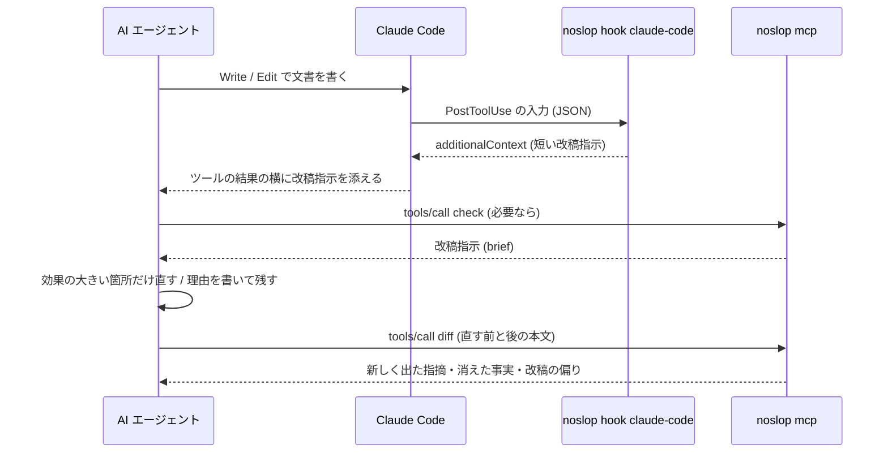

# AI エージェントとの連携

noslop の指摘を、文章を書いた AI エージェント (または人間の編集者) に渡す方法は 4 つあります。

| 方法 | 使いどころ | 渡すもの |
|---|---|---|
| `noslop check --report brief` | 検査結果を AI や編集者に貼り付けて直してもらう。プログラムや LLM に渡すなら JSON・TOON | 改稿指示 (Markdown・JSON・TOON) |
| `noslop skill-install` | エージェントに、日本語の文章を書いた・直した後の見直しの手順を覚えさせる | スキル (`SKILL.md`) |
| `noslop mcp` | エージェントが自分で検査・改稿の前後の比較を呼ぶ (Claude Code・Codex CLI など) | 改稿指示・確認事項 (Markdown・JSON・TOON) |
| `noslop hook claude-code` | Claude Code がファイルを書いた直後に、自動で指摘を渡す | 短い改稿指示 |

どの方法でも、渡すのは「どこを、なぜ見直すか」と改稿の制約です。語句の置き換え方は指示しません。指摘は疑いの提示なので、件数を減らすこと自体を目的にすると、読点を一律に削る・体言止めを機械的に足すといった別の均一さが生まれます。そのため改稿指示には、残してよいことと、再実行を 1 回で打ち切ることを必ず書いています。



## 改稿指示 (`--format brief`)

```bash
noslop check --format brief docs/
noslop check --format brief --brief-limit 3 draft.md | pbcopy   # AI に貼り付ける
cat draft.md | noslop check --format brief --stdin-filename draft.md -
```

出力は Markdown で、次の順に並びます。

1. **改稿のルール**: 主張・確信度・数字・固有名詞・引用・想定読者を変えない、原文にない事実・数字・体験を足さない (足りなければ書き手に確認する)、同じ直しを全箇所に一律に当てない、指摘は疑いなので残してよい (理由は書き手への報告に添える)、件数やスコアを目的にしない、再実行は 1 回だけ (直す前の文書があれば `noslop diff` で、新しく出た指摘と消えた数字・固有名詞をまとめて確かめる)
2. **ファイルごとの節**: 自然度スコアと、未抑制の指摘の件数 (AI 臭さの校正済み / 実験的 / 独自ルール / 読みやすさ)
3. **優先して見る箇所**: ルールごとにまとめ、重大度の高い順・件数の多い順に並べる。ルールの日本語名、なぜ疑わしいか (説明文の「なぜ問題か」の冒頭)、直し方の方向、該当箇所 (行・指摘・原文) を載せる。1 ルールあたり `--brief-limit` 件 (既定 5) まで並べ、残りは「ほか N 件」とまとめる
4. **読みやすさの指さし**: AI 臭さとは別の、優先度の低い指摘
5. **編集の問い**: ルールでは拾えない観点の問い (具体性、段落の論旨、エッセイなら書き手自身の判断や経験)。答えが「いいえ」でも、書き手に確かめずに内容を足さないよう書き添える

抑制コメントで残した指摘は載せません。指摘が 1 件もなければ、noslop の観点では直す必要がないことと、内容の正しさや読み手への合い方までは確かめていないことだけを出します。終了コードは他の形式と同じです (`--fail-on`)。

自然度スコアは「(参考)」として載せます。改稿のルールで、スコアや件数を目的にしないよう断っています。抑制コメントも、指摘を消すための手段としては勧めません。改稿した側は、残した指摘とその理由を書き手への報告に添え、書き手が今後も残すと決めた箇所にだけ抑制コメントを書きます。

### JSON と TOON (`--report brief --format json|toon`)

```bash
noslop check --report brief --format json draft.md   # プログラムで扱う
noslop check --report brief --format toon draft.md   # LLM に少ないトークンで渡す
```

Markdown と同じ改稿指示を、データとして出します。JSON と TOON は同じデータの符号化違いです。

| 階層 | フィールド |
|---|---|
| 全体 | `schemaVersion` (版。互換性のない変更で上げる)・`kind` (`brief`)・`tool`・`columnUnit` (`unicode-scalar`)・`settings` (`genre`・`experimental`)・`revisionRules` (改稿のルール)・`editorialQuestions` (編集の問い)・`note` (指摘がないときの断り書き。あれば `null`)・`files`・`cleanFiles` (指摘のないファイル。20 件まで)・`omittedCleanFiles`・`warnings` (抑制コメントの注意。`path`・`message`)・`errors` (読めなかったファイル。`path`・`message`) |
| `files[]` | `path`・`counts` (`stableSlop`・`experimentalSlop`・`custom`・`readability`)・`rules`・`occurrences` |
| `rules[]` | `ruleId`・`ruleName`・`title`・`lane`・`maxSeverity`・`experimentalOnly`・`count` (未抑制の件数)・`omittedCount` (`--brief-limit` を超えて載せなかった件数)・`why` (なぜ疑わしいか)・`hint` (直し方の方向。2 つあれば ` / ` でつなぐ) |
| `occurrences[]` | `ruleId` (`rules` を参照)・`line`・`column` (1 始まり。列は Unicode スカラー値の個数)・`message`・`excerpt` (指摘を含む文の抜粋。文を持たない指摘は `null`) |

ルールと該当箇所を入れ子にせず、2 つの表に分けているのは、TOON で 1 行 1 要素の表 (tabular form) にするためです。入れ子にすると、ルールごとに項目名の行が並んで、改行なしの JSON より長くなりました。表に分けると、同梱の `examples/ai-smelly.md` の改稿指示で、トークン数 (`o200k_base`) が TOON 2,770・Markdown 2,980・JSON 3,137 (改行なし) / 3,802 (整形) になります。

データには、自然度スコア・metrics・fingerprint・抑制した指摘・バイト位置を入れません。スコアは数字を目的にした書き直しを招くためで、指摘の追跡や前回の結果との突き合わせには全指摘のレポート (`--format json`・`--format toon`) を使います。`note` は指摘がないときだけ入り、内容の正しさまでは確かめていないことを伝えます。

TOON の符号化は公式の Rust 実装 [toon-format](https://github.com/toon-format/toon-rust) (仕様 v3.0) で行います。区切りはカンマ、インデントは 2、キーの折りたたみはせず、末尾に改行を付けません。出力は、仕様 v4.1 のリファレンス実装 (`@toon-format/toon` 4.1.1) の strict モードで、JSON と同じデータに戻ることを確かめています (カンマ・コロン・引用符・バックスラッシュ・`-` や `#` で始まる文字列を含む抜粋も含めて)。

## スキル (`noslop skill-install`)

```bash
noslop skill-install claude                       # ~/.claude/skills/noslop/SKILL.md
noslop skill-install codex                        # ~/.codex/skills/noslop/SKILL.md
noslop skill-install claude --dir .claude/skills  # プロジェクトに置く
```

[skills/SKILL.md](../skills/SKILL.md) (バイナリに埋め込んである) を、エージェントのスキルの置き場に `noslop/SKILL.md` として書きます。すでにあれば上書きするので、noslop を更新したら入れ直してください。ソースから `make install` で入れた場合は、バイナリを入れたあとに Claude Code と Codex CLI の両方へ自動で入れ直します (入れる先は `SKILL_TARGETS` で選べ、空にすると入れません)。スキルには、使う場面 (日本語の文章を書いた・直した後の見直し、推敲、AI っぽさのチェック)、手順 (`noslop check --report brief --format toon` で直す箇所を受け取る → 改稿のルールに従って直す → `noslop diff` で 1 回だけ確かめる)、TOON の読み方を書いています。

## MCP サーバー (`noslop mcp`)

標準入出力で JSON-RPC 2.0 のメッセージを 1 行に 1 つずつやり取りする MCP サーバーです。非同期ランタイムは使わず、1 リクエストずつ順に処理します。

### ツール

| ツール | 引数 | 返すもの |
|---|---|---|
| `check` | `text` (必須)、`filename` (拡張子で Markdown / テキストを判断)、`genre`、`experimental`、`report` (`brief` 既定 / `full`)、`format` (`markdown` / `json` / `toon`) | `report: brief` は改稿指示 (`format` の既定は `markdown`)、`report: full` は `check --format json` と同じ全指摘のレポート (`format` の既定は `json`)。`markdown` は `brief` のときだけ |
| `diff` | `before`・`after` (必須)、`filename`、`genre`、`experimental`、`format` (`text` 既定 / `json` / `toon`) | `noslop diff` と同じ確認事項 (新しく出た指摘・事実の変化・改稿の偏り)。text は端末向けの書式を外して返す |
| `explain` | `rule` (必須、ID か名前)、`genre` | `noslop explain` と同じ説明 |
| `rules` | `genre`、`experimental` | `noslop rules` と同じ一覧 |

引数の誤り (本文がない、未知のジャンルなど) と設定ファイルの誤りは、サーバーを止めずにツールの実行エラー (`isError: true`) として返します。エージェントはその文面を読んで引数を直せます。未知のツール名と壊れたメッセージは JSON-RPC のエラーで返します。1 メッセージは 8 MiB、`check` の本文は 4 MiB までです。

### 対応する版

| 版 | 方式 |
|---|---|
| `2026-07-28` | リクエストごとに `_meta` で版とクライアントの能力を名乗る方式。`server/discover` に答え、結果に `resultType` と、`_meta` のサーバー名を載せる。対応外の版には `-32022` (Unsupported protocol version) を、`_meta` の必須項目がなければ `-32602` を返す |
| `2025-11-25`・`2025-06-18`・`2025-03-26`・`2024-11-05` | `initialize` で版を決める方式。要求された版に対応していれば同じ版を、そうでなければ `2025-11-25` を返す。結果はその版の形のまま (`resultType` は付けない) |

`_meta` で版を名乗らないリクエストは、`initialize` の後 (と `ping`) だけ受け付けます。版の決まらないまま処理すると、クライアントがサーバーの方式を判別できないためです。

### 設定ファイル

`check` と同じく `noslop.toml` / `.noslop.toml` を親ディレクトリへたどって探します。探し始める場所は、環境変数 `CLAUDE_PROJECT_DIR` があればそのディレクトリ (Claude Code が起動したサーバーに渡すプロジェクトのルート)、なければサーバーの作業ディレクトリです。`noslop mcp --config path/to/noslop.toml` で指定したり、`--no-config` で読まないようにしたりもできます。設定を変えたらサーバーを起動し直してください。

### Claude Code に登録する

```bash
# このプロジェクトだけで使う (local スコープ)
claude mcp add noslop -- noslop mcp

# チームで共有する (.mcp.json に書かれる)
claude mcp add --scope project noslop -- noslop mcp
```

`.mcp.json` に直接書く場合:

```json
{
  "mcpServers": {
    "noslop": {
      "type": "stdio",
      "command": "noslop",
      "args": ["mcp"]
    }
  }
}
```

### Codex CLI に登録する

```bash
codex mcp add noslop -- noslop mcp
```

`~/.codex/config.toml` (信頼したプロジェクトなら `.codex/config.toml` も可) に直接書く場合:

```toml
[mcp_servers.noslop]
command = "noslop"
args = ["mcp"]
```

`noslop` が `PATH` にない場合は、`command` に `~/.cargo/bin/noslop` のようなフルパスを書いてください。

## Claude Code のフック (`noslop hook claude-code`)

Claude Code の PostToolUse フックとして動き、Write / Edit / MultiEdit で書き換えたファイルを検査します。指摘があれば、短い改稿指示を `hookSpecificOutput.additionalContext` で返します。Claude Code はこれをシステムリマインダーとしてツールの結果の横に添えるので、Claude は補足として受け取ります。`decision: "block"` や終了コード 2 はツールの失敗に見えるので使いません。

設定例は [examples/claude-code-settings.json](../examples/claude-code-settings.json) にあります。`~/.claude/settings.json` (すべてのプロジェクト)、`.claude/settings.json` (プロジェクトで共有)、`.claude/settings.local.json` (自分だけ) のいずれかに書きます。

```json
{
  "hooks": {
    "PostToolUse": [
      {
        "matcher": "Write|Edit|MultiEdit",
        "hooks": [
          {
            "type": "command",
            "command": "noslop hook claude-code",
            "timeout": 30
          }
        ]
      }
    ]
  }
}
```

### 動き

- 対象は Write / Edit / MultiEdit で、設定の `[files] extensions` (既定 `md` / `markdown` / `txt`) の拡張子を持ち、`[files] exclude` に当たらないファイルだけです。それ以外は何も出力せず、終了コード 0 で終わります
- 設定ファイルは、フックの入力にある `cwd` から親へたどって探します (`--config` / `--no-config` で指定できます)
- 既定では読みやすさのルールを止めて検査し、AI 臭さ (校正済み) と独自ルールの指摘があるときだけ返します。`--experimental` で実験的なルールを、`--include-readability` で読みやすさの指摘を加えます (設定ファイルで `experimental = true` にしていれば、実験的なルールも既定で動きます)
- 返すのは、今回のツール呼び出しで変わった行に、指摘の箇所か文脈 (文・段落) が重なるものだけです。編集のたびに同じ指摘を渡して、残すと決めた箇所まで直させないためです。変わった行は、ツールの結果にある差分 (`tool_response.structuredPatch`) から求めます。差分がなければ Edit / MultiEdit の `new_string` の位置から求め、同じ文字列がほかにもある・削除だけの編集・見つからない (別のフックが整形したなど) ときは、ファイル全体の指摘を返します。新しく作ったファイルも全体を見ます。常にファイル全体を見るなら `--whole-file` を付けます
- 1 ルールあたりの箇所は `--brief-limit` 件 (既定 3) までです。自然度スコアは載せません (編集のたびに数字を見せると、数字を上げること自体が目的になりやすいため)
- Claude Code は 10,000 文字を超える additionalContext をファイルに逃がして先頭しか見せないので、それより短く (9,000 文字まで) 行単位で切ります
- 入力が JSON として読めない・32 MiB を超える・設定ファイルが壊れているなどの誤りは、標準エラーに書いて終了コード 1 で終わります。Claude Code はこれを処理を止めないエラーとして扱います。8 MiB を超えるファイルは検査せずに飛ばします

### 手で試す

```bash
printf '{"hook_event_name":"PostToolUse","tool_name":"Write","cwd":"%s","tool_input":{"file_path":"docs/guide.md"}}' "$PWD" \
  | noslop hook claude-code
```

指摘があれば `{"hookSpecificOutput":{"hookEventName":"PostToolUse","additionalContext":"..."}}` が 1 行出ます。何も出なければ、対象外のファイルか指摘がないかのどちらかです。

## 参考

- MCP の版と `_meta`: <https://modelcontextprotocol.io/specification/2026-07-28/basic/versioning>
- `server/discover`: <https://modelcontextprotocol.io/specification/2026-07-28/server/discover>
- `initialize` による版の決定 (2025-11-25): <https://modelcontextprotocol.io/specification/2025-11-25/basic/lifecycle>
- Claude Code のフック: <https://code.claude.com/docs/en/hooks>
- Claude Code の MCP: <https://code.claude.com/docs/en/mcp>
